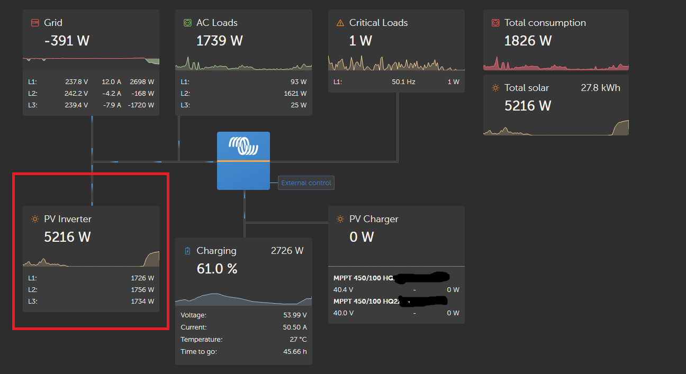
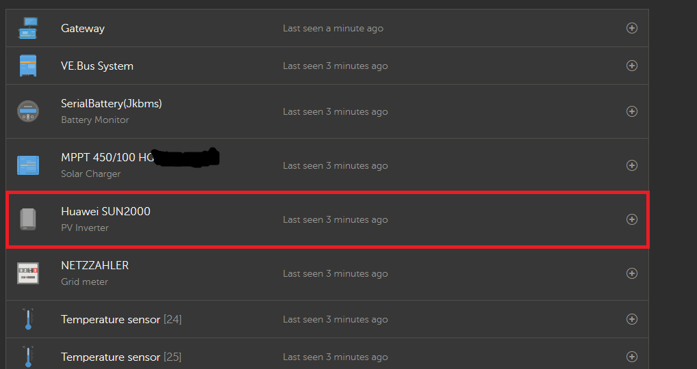

# dbus-huaweisun2000-pvinverter

D-Bus driver for Victron Cerbo GX / Venus OS for Huawei SUN 2000 inverters

## Purpose

This script is intended to help integrate a Huawei SUN 2000 inverter into the Venus OS and thus also into the VRM
portal.

I use a Cerbo GX, which I have integrated via Ethernet in the house network. I used the WiFi of the device to connect to
the internal WiFi of the Huawei Sun 2000. Note: No extra dongle is necessary! You can use the integrated Wifi,
which is actually intended for configuration with the Huawei app (Fusion App or Sun2000 App). The advantage is that no
additional hardware needs to be purchased and the inverter does not need to be connected to the Internet.

To further use the data, the mqtt broker from Venus OS can be used.

## Todo

- [ ] Display alarm values
- [ ] more values: temperature, efficiency
- [ ] clean code
- [ ] If possible, identify the meter model (DDSU666-H or DTSU666-H) and serial number
- [ ] Make register set configurable so that more SUN2000 models can be supported
- [ ] Add support for multiple inverters
- [ ] Venus OS gui-v2 support

## Installation / Update

1. When updating, read the CHANGELOG.md to see whether there are breaking changes that need your attention.

2. Download and run the installation / update script:

   ```bash
   wget -qO- https://raw.githubusercontent.com/lukeg01/dbus-huaweisun2000-pvinverter/main/dbus-huaweisun2000-pvinverter/setup/install_or_update.sh | bash
   ```

   This will download the latest release and install it. If you want to install the development version, use:

   ```bash
   wget -qO- https://raw.githubusercontent.com/lukeg01/dbus-huaweisun2000-pvinverter/main/dbus-huaweisun2000-pvinverter/setup/install_or_update.sh | bash -s dev
   ```

3. Configure the driver

   **Option A: Interactive configuration (recommended)**
   
   The installer will prompt you to configure the driver. Or run anytime:
   
   ```bash
   /data/dbus-huaweisun2000-pvinverter/configure.sh
   ```
   
   This will interactively ask for:
   - Modbus host IP address
   - Modbus port (6607 for SDongle, 502 for Ethernet)
   - Modbus unit ID (usually 0)
   - Register version (V3 for modern inverters)
   - System type (single-phase or three-phase)
   - Single-phase position (L1/L2/L3)

   **Option B: Manual D-Bus configuration**
   
   ```bash
   dbus -y com.victronenergy.settings /Settings/HuaweiSUN2000/ModbusHost SetValue "192.168.1.100"
   dbus -y com.victronenergy.settings /Settings/HuaweiSUN2000/ModbusPort SetValue 6607
   dbus -y com.victronenergy.settings /Settings/HuaweiSUN2000/ModbusUnit SetValue 0
   dbus -y com.victronenergy.settings /Settings/HuaweiSUN2000/ModbusVersion SetValue "V3"
   dbus -y com.victronenergy.settings /Settings/HuaweiSUN2000/SystemType SetValue 0
   dbus -y com.victronenergy.settings /Settings/HuaweiSUN2000/SinglePhasePosition SetValue 1
   /data/dbus-huaweisun2000-pvinverter/restart.sh
   ```

   **Option C: Configuration file (for advanced users)**
   
   Create a file called `override_config.py`. Copy the `example_override_config.py` to `override_config.py` and adjust the values as needed. Note that this will override all other settings.

## Debugging

If things don't work: check Modbus TCP Connection to the inverter

   `python /data/dbus-huaweisun2000-pvinverter/connector_modbus.py`

You can check the status of the service with svstat:

`svstat /service/dbus-huaweisun2000-pvinverter`

It will show something like this:

`/service/dbus-huaweisun2000-pvinverter: up (pid 10078) 325 seconds`

If the number of seconds is always 0 or 1 or any other small number, it means that the service crashes and gets
restarted all the time.

When you think that the script crashes, stop the service and start it directly from the command line:

`python /data/dbus-huaweisun2000-pvinverter/dbus-huaweisun2000-pvinverter.py`

Also useful (note that you need to restart this often, as the "current" log file is rotated every few lines):

`tail -f /var/log/dbus-huaweisun2000/current | tai64nlocal`

### Stop the script

`svc -d /service/dbus-huaweisun2000-pvinverter`

### Start the script

`svc -u /service/dbus-huaweisun2000-pvinverter`

### Restart the script

If you want to restart the script, for example after changing it, just run the following command:

`sh /data/dbus-huaweisun2000-pvinverter/restart.sh`

## Uninstall the driver

Run

   ```bash
sh /data/dbus-huaweisun2000-pvinverter/uninstall.sh
rm -r /data/dbus-huaweisun2000-pvinverter/
   ```

## Examples





## Thank you

### Contributers

- DenkBrettl
- ricpax (Energy meter code)

### Used libraries

modified verion of <https://github.com/olivergregorius/sun2000_modbus>

### this project is inspired by

<https://github.com/RalfZim/venus.dbus-fronius-smartmeter>

<https://github.com/fabian-lauer/dbus-shelly-3em-smartmeter.git>

<https://github.com/victronenergy/velib_python.git>
